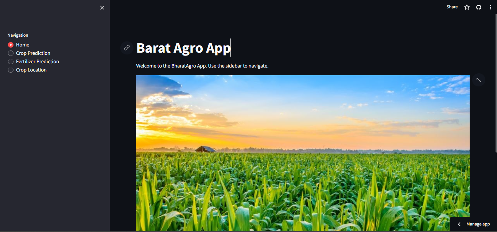
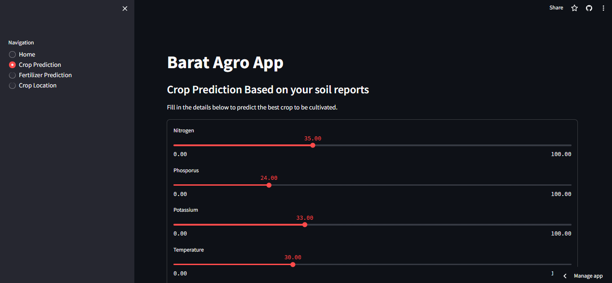
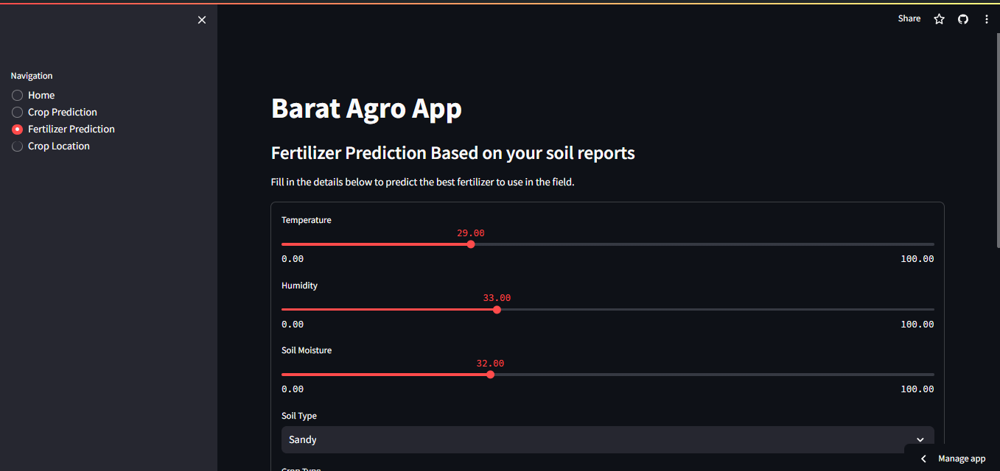
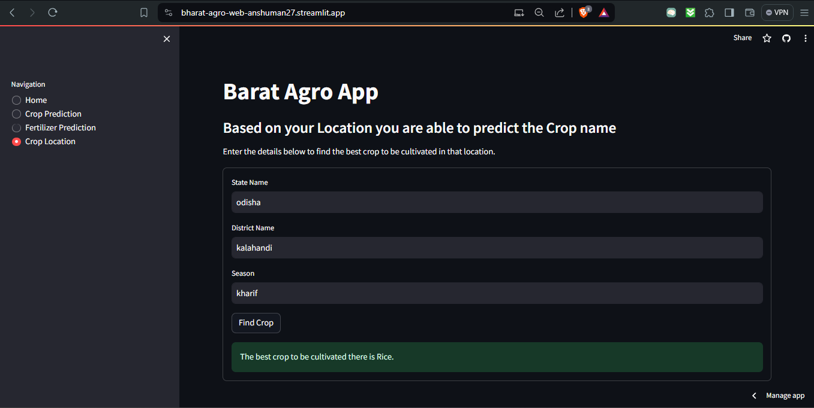

# BharatAgro App

BharatAgro is a web application designed to assist farmers in making informed decisions about crop selection and fertilizer usage based on various factors such as soil composition, climate conditions, and geographical location.

## Features

### 1. Home
- **Description**: The landing page provides a brief introduction to the BharatAgro App.
- **Functionality**: Users can navigate through different sections using the sidebar.

### 2. Crop Prediction
- **Description**: Predicts the best crop to be cultivated based on soil reports.
- **Inputs**: Nitrogen, Phosphorus, Potassium, Temperature, Humidity, pH, Rainfall.
- **Algorithms**: Utilizes machine learning models including Decision Tree, Naive Bayes, Support Vector Machine (SVM), Linear Regression, and Logistic Regression, trained on soil data to make predictions.
- **Output**: Displays the recommended crop for cultivation.

### 3. Fertilizer Prediction
- **Description**: Predicts the best fertilizer to use based on soil reports and crop type.
- **Inputs**: Temperature, Humidity, Soil Moisture, Soil Type, Crop Type, Nitrogen, Phosphorus, Potassium.
- **Algorithm**: Utilizes a Random Forest Classifier, trained on fertilizer data to make predictions.
- **Output**: Displays the recommended fertilizer for use in the field.

### 4. Crop Location
- **Description**: Predicts the best crop to be cultivated based on geographical location.
- **Inputs**: State Name, District Name, Season.
- **Functionality**: Retrieves crop data based on the provided location from a predefined mapping.
- **Output**: Displays the recommended crop for cultivation in the specified location.

### webApp images 









## Getting Started
1. Clone the repository to your local machine.
    ```bash
    git clone  https://github.com/anshumanbehera27/BharatAgroWeb.git
    ```

2. Install the required dependencies by running the following command in your terminal:
    ```bash
    pip install -r requirements.txt
    ```

3. Run the application by executing the following command in your terminal:
    ```bash
    streamlit run app.py
    ```

4. Access the application in your web browser at the provided URL.
   [BhartAgroApp](https://bharat-agro-web-anshuman27.streamlit.app/)


## Contributing
Contributions are welcome! If you have any suggestions or improvements, feel free to open an issue or submit a pull request.

## License
This project is licensed under the [MIT License](LICENSE).


